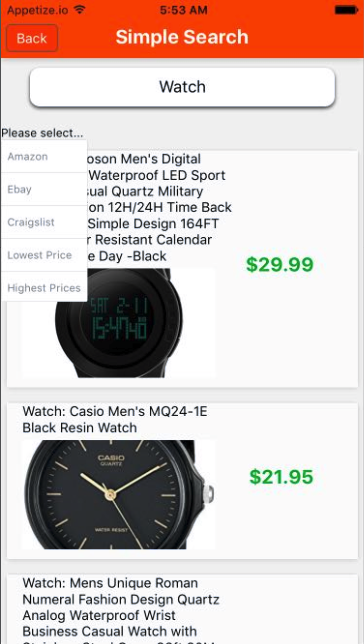
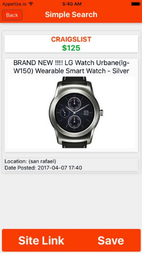
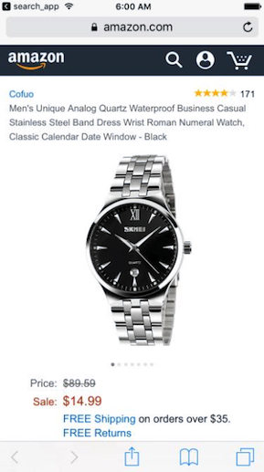

# Simple Search

[demo](https://appetize.io/app/0x091dfuwcr3wd4xgr1dejt8e4?device=iphone7&scale=75&orientation=portrait&osVersion=10.3&deviceColor=black)


## Background

Simple Search is an iOS app built using React Native.  The app is intended
to make searching across multiple sale sites easy.  Users may search for
any particular item they are looking to buy, and have the option to add
the item to their track list.  

## Features and Implementation

### Search Across Multiple Platforms
The app searches across the most popular shopping sites all in one place. (Craigslist, Ebay, and Amazon)

```
    makeRequest(source) {
      let url = 'https://craigslist-simple-search.herokuapp.com/' + source + '?search=' + this.state.search;
      let xhr = new XMLHttpRequest();
      xhr.open('GET', url);
      xhr.responseType = 'json';
      let that = this;
      xhr.onload = function() {
        let tmp_results = that.state.results.concat(xhr.response)
        that.setState({results: tmp_results});
      };
      xhr.onerror = function() {
        console.log(`Error with ${source}`);
      };
      xhr.send();
    }

    handleSubmit(e) {
      if (this.state.searchType === undefined) {
        this.makeRequest('craigslist');
        this.makeRequest('ebay');
        this.makeRequest('amazon');
      }
      else {
        let that = this;
        this.state.searchType.forEach( (source) => that.makeRequest(source));
      }
    }
```



### Item View

  

Users can first view items on Simple Search and if decide to buy can be directed
to website.


### Tracking Items


Users can keep track of items to buy at a later time.


## Future Implementations

- Send notification to User if price drops
- Implement a popular items page
- Market Simple Search
- Android Support
